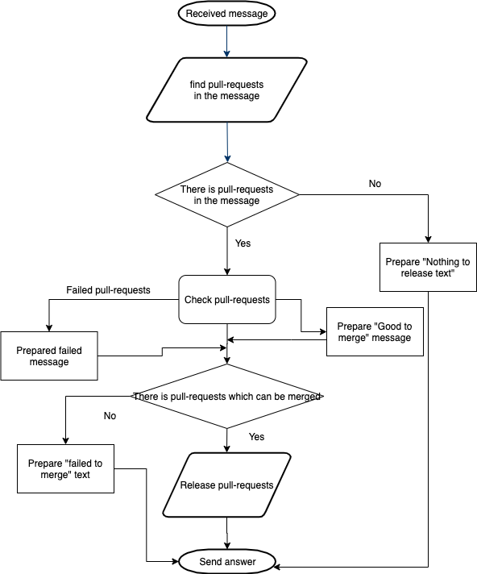
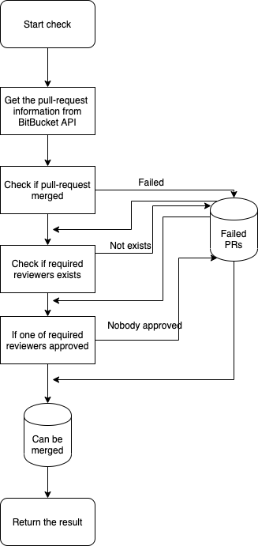
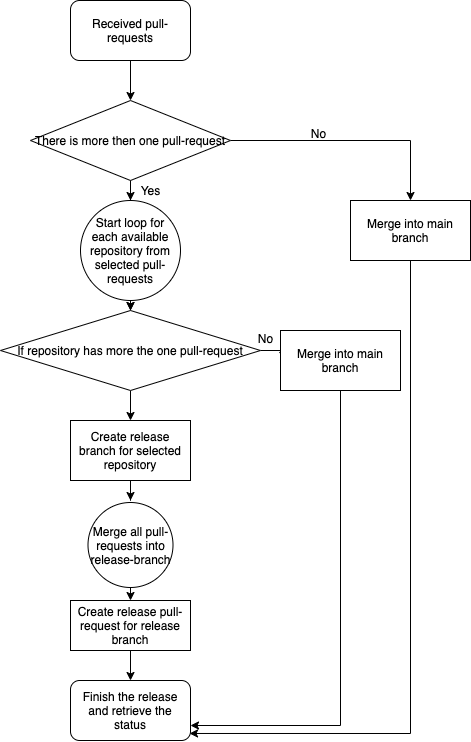

# BitBucket Release event
The event can merge one or multiple pull-requests into main branch of the repository, to which that pull-request related.
This is event for [sharovik/devbot](https://github.com/sharovik/devbot) automation bot.

You can use this event for release optimisation of your project/projects. In the message text be specified 1 or multiple pull-requests for multiple repositories, if they are good for merge, then event will try to merge all of them into main branch of repository.
The event accepts multiple pull-requests for multiple repositories. If there is more than one pull-request per repository, then event will create a **release pull-request**, which should be approved by on of required reviewers and will send this pull-request link in the answer of the message.

## Table of contents
- [How it works](#how-it-works)
- [Prerequisites](#prerequisites)

## How it works
You send the message to the PM of bot with the next text: 
```
bb release
https://bitbucket.org/{your-workspace}/{your-first-repository}/pull-requests/1/readmemd-edited-online-with-bitbucket/diff
https://bitbucket.org/{your-workspace}/{your-second-repository}/pull-requests/20
https://bitbucket.org/{your-workspace}/{your-second-repository}/pull-requests/36/release-pull-request/diff
https://bitbucket.org/your-workspace}/{your-first-repository/pull-requests/35/release-pull-request/diff
```
In the answer you will receive the status update of the merge process. 
If there will be more then 2 pull-requests per repository, the bot will try to create a release branch, merge all pull-requests into that branch and then will create the release-pull-request from that branch and share it into the channel.

Also you can configure bot to send the report after each "event trigger" to the specific channel.

## Prerequisites
Before you will start use this event please be aware of these steps

### Clone into devbot project
```
git clone git@github.com:sharovik/bitbucket-release-event.git events/bitbucket_release
```

### Install it into your devbot project
1. clone this repository into `events/` folder of your devbot project. Please make sure to use `bitbucket_release` folder name for this event 
2. add into imports path to this event in `defined-events.go` file
``` 
import "github.com/sharovik/devbot/events/bitbucket_release"
```
3. add this event into `defined-events.go` file to the defined events map object
``` 
DefinedEvents.Events[bitbucket_release.EventName] = bitbucket_release.Event
```

### Prepare environment variables in your .env
Copy and paste everything from the **#Bitbucket** section in `.env.example` file into `.env` file

### Create BitBucket client
Here [you can find how to do it](https://github.com/sharovik/devbot/blob/master/documentation/bitbucket_client_configuration.md).

### The main diagram
Here you can see the main flow how this event works



### The pull-request checks
In this diagram you can see how the current pull-request check works



### The release process
In this diagram you can see the flow of the release


